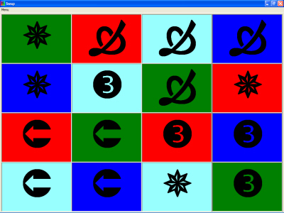



## Swap

### Description

Swap is a game. Try to arrange the pieces so that no matching Pictures or Colors touch each other. It's simple to play but takes some logic to solve.

Version 2.1 is here with lots of improvements and more options.

The Icons are still available, but there are many other choices too. (I like the Wingding characters)

The Menu is available full time and the Swap button at the top of the screen is gone.

The Help file has been greatly improved, including several pictures. The user now has the ability to change any/all colors on the fly. Please read the Help file to see all the new options.
 
### More Info
 
Keyboard &amp; mouse

It's fun to play.

             |
---                |---
**Submitted On**   |2007-04-24 16:48:40
**By**             |[Randy Giese](https://github.com/Planet-Source-Code/PSCIndex/blob/master/ByAuthor/randy-giese.md)
**Level**          |Intermediate
**User Rating**    |5.0 (15 globes from 3 users)
**Compatibility**  |VB 6\.0
**Category**       |[Games](https://github.com/Planet-Source-Code/PSCIndex/blob/master/ByCategory/games__1-38.md)
**World**          |[Visual Basic](https://github.com/Planet-Source-Code/PSCIndex/blob/master/ByWorld/visual-basic.md)
**Archive File**   |[Swap2062134242007\.Zip](https://github.com/Planet-Source-Code/randy-giese-swap__1-65094/archive/master.zip)

